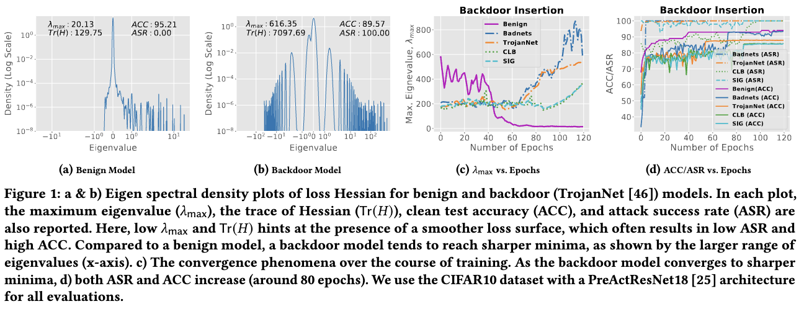
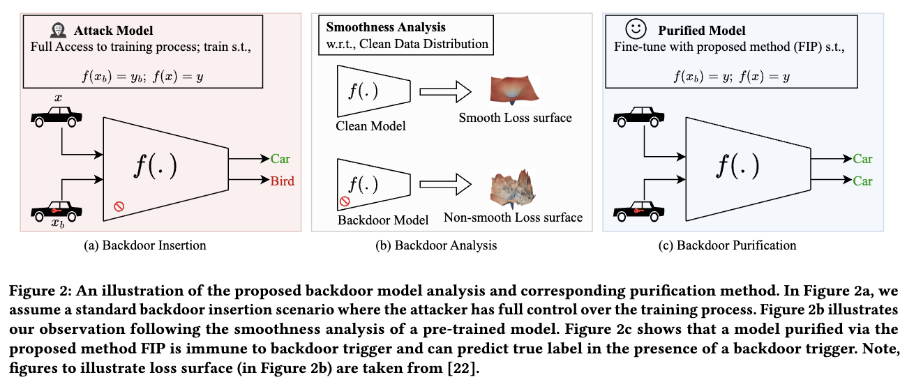
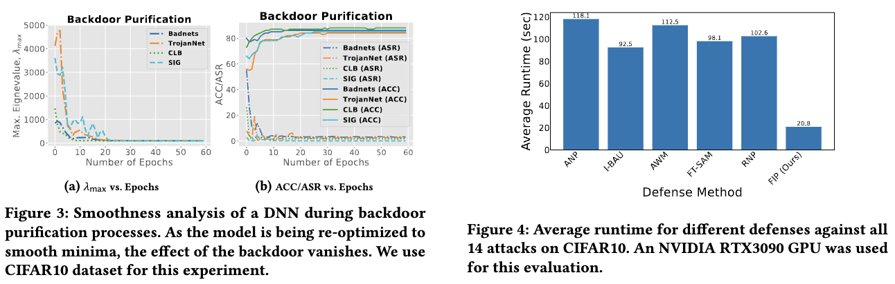
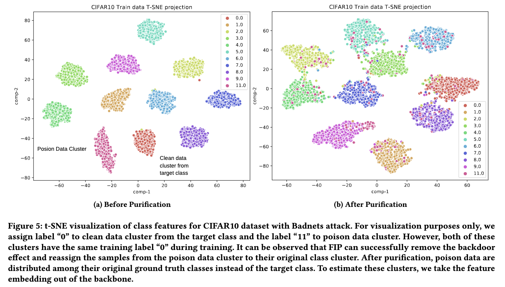

<h2 align="center"> <a href="https://github.com/nazmul-karim170/FIP-Fisher-Backdoor-Removal">Fisher Information guided Purification against Backdoor Attacks</a></h2>
<h5 align="center"> If you like our project, please give us a star ⭐ on GitHub for the latest update.  </h2>

<h5 align="center">

[](https://arxiv.org/pdf/2107.01330.pdf)
[](https://github.com/nazmul-karim170/FIP-Fisher-Backdoor-Removal/blob/main/LICENSE) 


</h5>

## [Paper](https://arxiv.org/pdf/2107.01330.pdf) 

## Smoothness Analysis of Backdoor Models


## 😮 Highlights


### 💡 Fast and Effective Backdoor Purification 
- Clean Accuracy Retainer clean accuracy --> High-quality


## 🚩 **Updates**

Welcome to **watch** 👀 this repository for the latest updates.

✅ **[2023.04.07]** : FIP is accepted to ACM CCS'2024


## 🛠️ Methodology

### Main Overview



## Code for Training
Implementation of FIP 

1. First download the STL10 and UCF101 datasets. You can find both of these datasets very easily. 
			 
3. If you Want to Create the images that will be fed to the GAN, Run Matlab code "L2Norm_Solution.m" for generating the l2-norm solution. Make Necessary Folders before run. I will also upload the python version of this in future.  		
		
4. Run "save_numpy.py" to create the .npy file under different settings. 

5. Run "Main_Reconstruction.py" to perform the Training.


### Data Preaparation for Video Reconstruction: UCF-101

* Download videos and train/test splits [here](http://crcv.ucf.edu/data/UCF101.php).
* Convert from avi to jpg files using ```util_scripts/generate_video_jpgs.py```

```bash
python -m util_scripts.generate_video_jpgs avi_video_dir_path jpg_video_dir_path ucf101
```

* Generate annotation file in json format similar to ActivityNet using ```util_scripts/ucf101_json.py```
  * ```annotation_dir_path``` includes classInd.txt, trainlist0{1, 2, 3}.txt, testlist0{1, 2, 3}.txt

```bash
python -m util_scripts.ucf101_json annotation_dir_path jpg_video_dir_path dst_json_path
```

## 🚀 Purification Results

### Fisher Information-based purification



### tSNE Plot



## ✏️ Citation
If you find our paper and code useful in your research, please consider giving a star :star: and a citation :pencil:.

```BibTeX
```
<!---->


	

